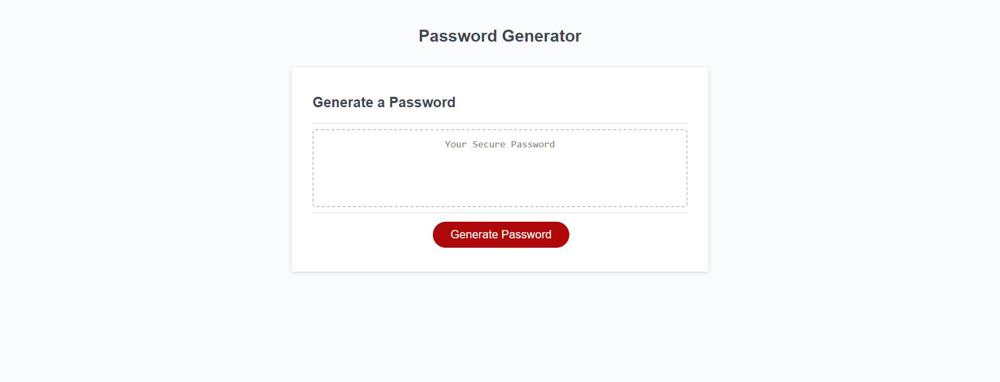

# pirate-king

## Description
Here is the assignment for generating a password. In this assignment, we were supposed to prompt the computer to generate different questions for the user to make proper imput to make the custom password. Then the code gathers the user input to create a password according to what the user specifies. Once that is done, the code reveals the password for the user to use in whatever setting nessary for them.
## Installation
N/A
## Usage
[Click to see the final product] ()
## Credits
N/A
## License
[MIT](https://choosealicense.com/licenses/mit/)

## Useful Links
